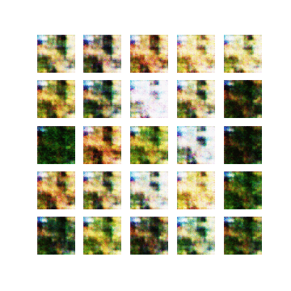

# TransGAN: Two Pure Transformers Can Make One Strong GAN
Implementation of the paper:

> Yifan Jiang, Shiyu Chang and Zhangyang Wang. [TransGAN: Two Pure Transformers Can Make One
Strong GAN, and That Can Scale Up](https://arxiv.org/abs/2102.07074). 


This repository implements conditional GAN image generation.

See [here](https://github.com/VITA-Group/TransGAN) for the official Pytorch implementation.


## Dependencies
- Python 3.8
- Tensorfow 2.5


## Usage
### Train
1. Use `--model_name=<name>` to provide the checkpoint directory name. 
```
python train.py --model_name=<name> 
```

#### CIFAR-10


### Hparams setting
Set hyperparameters on the `hparams.py` file.

### Tensorboard
Run `tensorboard --logdir ./`.


## Implementation notes
- Conditional GAN image generation.


## Licence
MIT