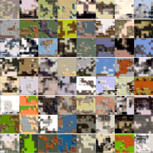

# TransGAN
Implementation of the Transformer-based GAN model in the paper:

> Yifan Jiang, Shiyu Chang and Zhangyang Wang. [TransGAN: Two Pure Transformers Can Make One
Strong GAN, and That Can Scale Up](https://arxiv.org/abs/2102.07074). 


See [here](https://github.com/VITA-Group/TransGAN) for the official Pytorch implementation.


## Dependencies
- Python 3.8
- Tensorfow 2.5


## Usage
### Train
1. Use `--dataset_path=<path>` to provide the dataset path (default builds CIFAR-10 dataset) and `--model_name=<name>` to provide the checkpoint directory name.
```
python train.py --dataset_path=<path> --model_name=<name> 
```

### Hparams setting
Adjust hyperparameters on the `hparams.py` file.

### Tensorboard
Run `tensorboard --logdir ./`.


## Examples
- CIFAR-10 training progress




## References
Code:
- This model depends on other files that may be licensed under different open source licenses.
- TransGAN uses Shengyu Zhao, Zhijian Liu, Ji Lin, Jun-Yan Zhu and Song Han. [Differentiable Augmentation](https://arxiv.org/abs/2006.10738). Under BSD 2-Clause "Simplified" License.
- Small-TransGAN models are instances of the original TransGAN architecture with a smaller number of layers and lower-dimensional embeddings.

Implementation notes:
- Single layer per resolution Generator.
- Orthogonal initializer and 4 heads in both Generator and Discriminator.
- WGAN-GP loss.
- Adam with β1 = 0.0 and β2 = 0.99.
- Noise dimension = 64.
- Batch size = 64

## Licence
MIT
