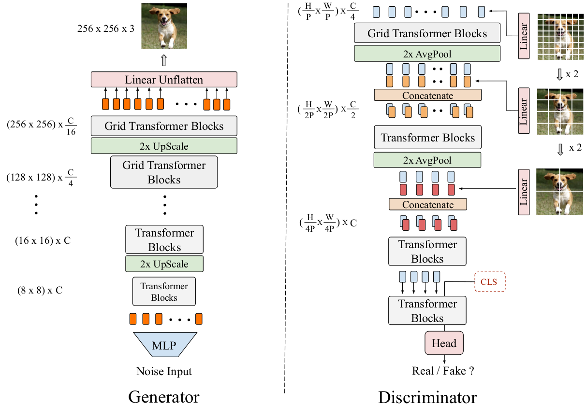
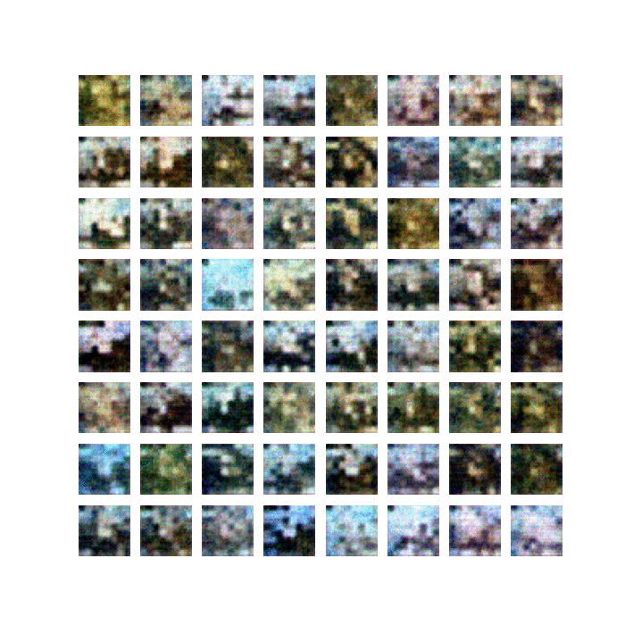

# TransGAN: Two Pure Transformers Can Make One Strong GAN
Implementation of the paper:

> Yifan Jiang, Shiyu Chang and Zhangyang Wang. [TransGAN: Two Pure Transformers Can Make One
Strong GAN, and That Can Scale Up](https://arxiv.org/abs/2102.07074). 



See [here](https://github.com/VITA-Group/TransGAN) for the official Pytorch implementation.


## Dependencies
- Python 3.8
- Tensorfow 2.5


## Usage
### Train
1. Use `--model_name=<name>` to provide the checkpoint directory name. 
```
python train.py --model_name=<name> 
```

### Hparams setting
Set hyperparameters on the `hparams.py` file.

### Tensorboard
Run `tensorboard --logdir ./`.


## Examples
### CIFAR-10
Images generated by Small-TransGAN.




## Implementation notes
- This model depends on other files that may be licensed under different open source licenses.
- Shengyu Zhao, Zhijian Liu, Ji Lin, Jun-Yan Zhu and Song Han. [Differentiable Augmentation](https://arxiv.org/abs/2006.10738). Under BSD 2-Clause "Simplified" License.
- This repository implements conditional GAN image generation.
- Example images can be generated faster using _hinge loss_ instead of _wgan-gp_ and a single layer per resolution (see default hyperparameters).


## Licence
MIT